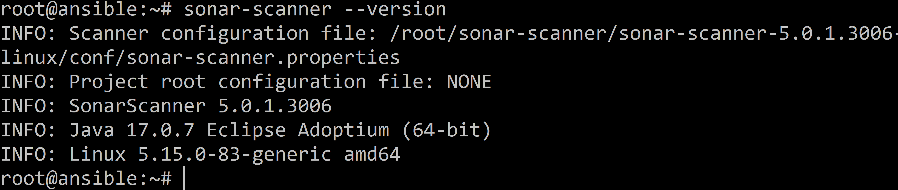
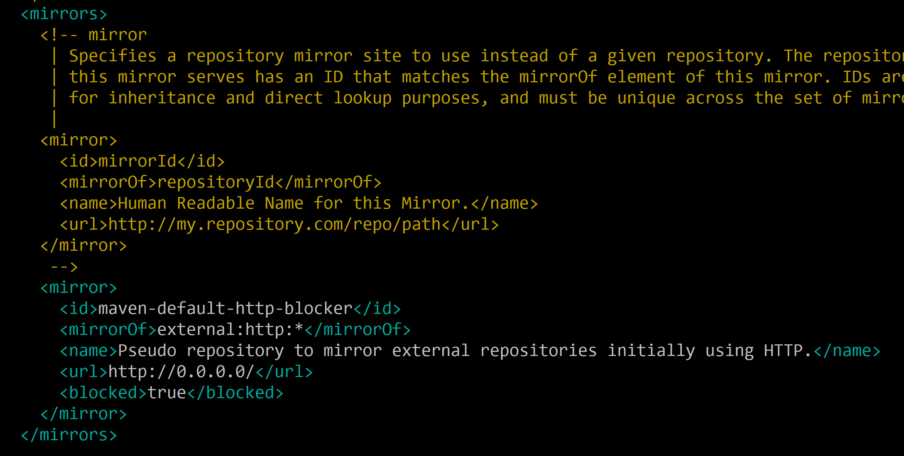

# Домашнее задание к занятию 9 «Процессы CI/CD»

## Подготовка к выполнению

1. Создайте два VM в Yandex Cloud с параметрами: 2CPU 4RAM Centos7 (остальное по минимальным требованиям).

Через террформ создал 3 ВМ. Одна ансибл, и с нее настраиваются остальные.

2. Пропишите в [inventory](./infrastructure/inventory/cicd/hosts.yml) [playbook](./infrastructure/site.yml) созданные хосты.
3. Добавьте в [files](./infrastructure/files/) файл со своим публичным ключом (id_rsa.pub). Если ключ называется иначе — найдите таску в плейбуке, которая использует id_rsa.pub имя, и исправьте на своё.
4. Запустите playbook, ожидайте успешного завершения.

Исправил ошибки - не скачивалась 11 psql, заменил на 14 и скорректировал код что бы везде версия psql бралась бы из  переменной. Не везде это было в коде.
Плейбук отработал без ошибок:


5. Проверьте готовность SonarQube через [браузер](http://localhost:9000).

Готово.


6. Зайдите под admin\admin, поменяйте пароль на свой.

Сделал.

7.  Проверьте готовность Nexus через [бразуер](http://localhost:8081).

Готово.


8. Подключитесь под admin\admin123, поменяйте пароль, сохраните анонимный доступ.
Сделал.


## Знакомоство с SonarQube

### Основная часть

1. Создайте новый проект, название произвольное.


2. Скачайте пакет sonar-scanner, который вам предлагает скачать SonarQube.

Скачал:

3. Сделайте так, чтобы binary был доступен через вызов в shell (или поменяйте переменную PATH, или любой другой, удобный вам способ).


4. Проверьте `sonar-scanner --version`.



5. Запустите анализатор против кода из директории [example](./example) с дополнительным ключом `-Dsonar.coverage.exclusions=fail.py`.

```
root@ansible:~/SonarQube-Nexus-Maven/example# sonar-scanner \
  -Dsonar.projectKey=myproject \
  -Dsonar.sources=. \
  -Dsonar.host.url=http://158.160.53.118:9000 \
  -Dsonar.login=1daec88195a9ab002bab5bae27da3fee0924d87f \
> -Dsonar.coverage.exclusions=fail.py
```


6. Посмотрите результат в интерфейсе.


7. Исправьте ошибки, которые он выявил, включая warnings.


8. Запустите анализатор повторно — проверьте, что QG пройдены успешно.


9. Сделайте скриншот успешного прохождения анализа, приложите к решению ДЗ.

## Знакомство с Nexus

### Основная часть

1. В репозиторий `maven-public` загрузите артефакт с GAV-параметрами:

 *    groupId: netology;
 *    artifactId: java;
 *    version: 8_282;
 *    classifier: distrib;
 *    type: tar.gz.
   
Создал пустой файл:


И загрузил:


2. В него же загрузите такой же артефакт, но с version: 8_102.

Еще раз загрузил только версию другую сделал.

3. Проверьте, что все файлы загрузились успешно.


4. В ответе пришлите файл `maven-metadata.xml` для этого артефекта.

```
<metadata modelVersion="1.1.0">
<groupId>netology</groupId>
<artifactId>java</artifactId>
<versioning>
<latest>8_282</latest>
<release>8_282</release>
<versions>
<version>8_102</version>
<version>8_282</version>
</versions>
<lastUpdated>20240514060218</lastUpdated>
</versioning>
</metadata>
```


### Знакомство с Maven


# 24/05/16 корректировки 

### Подготовка к выполнению

1. Скачайте дистрибутив с [maven](https://maven.apache.org/download.cgi).

```
wget https://dlcdn.apache.org/maven/maven-3/3.9.6/binaries/apache-maven-3.9.6-bin.zip
unzip apache-maven-3.9.6-bin.zip -d mvn/
```

Зайти в папку bin и:

```
export PATH=$(pwd):$PATH
```

2. Разархивируйте, сделайте так, чтобы binary был доступен через вызов в shell (или поменяйте переменную PATH, или любой другой, удобный вам способ).

3. Удалите из `apache-maven-<version>/conf/settings.xml` упоминание о правиле, отвергающем HTTP- соединение — раздел mirrors —> id: my-repository-http-unblocker.


Нашел:



Удалил просто все строчки конфига где был прописан mirror.


4. Проверьте `mvn --version`.


5. Заберите директорию [mvn](./mvn) с pom.

В pom файле указал IP сервера nexus.
подтянул из гита весь код на сервер sonar-01 .

### Основная часть

1. Поменяйте в `pom.xml` блок с зависимостями под ваш артефакт из первого пункта задания для Nexus (java с версией 8_282).

Поменял так:

```
<project xmlns="http://maven.apache.org/POM/4.0.0" xmlns:xsi="http://www.w3.org/2001/XMLSchema-instance"
  xsi:schemaLocation="http://maven.apache.org/POM/4.0.0 http://maven.apache.org/xsd/maven-4.0.0.xsd">
  <modelVersion>4.0.0</modelVersion>
 
  <groupId>netology</groupId>
  <artifactId>simple-app</artifactId>
  <version>1.0-SNAPSHOT</version>
   <repositories>
    <repository>
      <id>my-repo</id>
      <name>maven-public</name>
      <url>http://158.160.108.198:8081/repository/maven-public/</url>
    </repository>
  </repositories>
  <dependencies>
    <dependency>
      <groupId>netology</groupId>
      <artifactId>java</artifactId>
      <version>8_282</version>
      <classifier>distrib</classifier>
      <type>tar.gz</type>
    </dependency>
  </dependencies>
</project>
```
Изменил групп и блок с зависимостями - подставил ip nexus.


2. Запустите команду `mvn package` в директории с `pom.xml`, ожидайте успешного окончания.


Зависимость успешно подтянулась, хоть она и пустая.

3. Проверьте директорию `~/.m2/repository/`, найдите ваш артефакт.


- подтянулось.

4. В ответе пришлите исправленный файл `pom.xml`.

см. выше и в репозитории git-hub.


---

### Как оформить решение задания

Выполненное домашнее задание пришлите в виде ссылки на .md-файл в вашем репозитории.

---
